# Batman - Glamsterdam BAL detector

[](https://github.com/icedracon/batman/actions/workflows/ci.yml)
[](pyproject.toml)
[](LICENSE)

Batman is a reproducible cross-client detector for Ethereum's **Glamsterdam** upgrade.
Phase 1 targets **EIP-7928 Block-Level Access Lists (BAL)**: it builds the same block on
multiple execution clients, compares their independently computed BALs, and localizes any
divergence to the exact account / storage slot / `block_access_index`.

Architecture and scope: **[docs/ARCHITECTURE.md](docs/ARCHITECTURE.md)** (authoritative).
Roadmap: **[ROADMAP.md](ROADMAP.md)**.
Compatibility matrix: **[docs/COMPATIBILITY_MATRIX.md](docs/COMPATIBILITY_MATRIX.md)**.
Public evidence workflow: **[docs/PUBLIC_EVIDENCE.md](docs/PUBLIC_EVIDENCE.md)**.
Readiness report: **[docs/GLAMSTERDAM_BAL_READINESS_REPORT.md](docs/GLAMSTERDAM_BAL_READINESS_REPORT.md)**.
GitHub presentation checklist: **[docs/GITHUB_POLISH.md](docs/GITHUB_POLISH.md)**.

## Demo



The lightweight animated demo shows the intended reviewer workflow: generate a synthetic
control, run the offline canonicalization campaign, compare execution clients only on a
shared private-devnet head, and export an explicitly selected evidence bundle.

## Why this matters for Ethereum clients

EIP-7928 makes BAL output consensus-adjacent data: execution clients must agree on the exact
canonical bytes and therefore on `block_access_list_hash` for the same block. Small differences
in ordering, duplicate handling, read/write classification, or `block_access_index` assignment
can become cross-client interoperability failures.

Batman focuses on that narrow, high-signal surface. It gives client teams and protocol
researchers a reproducible private-devnet workflow that catches disagreement early, refuses
misleading comparisons when heads do not align, and preserves compact evidence for responsible
private disclosure. More detail: **[docs/WHY_THIS_MATTERS.md](docs/WHY_THIS_MATTERS.md)**.

Open roadmap issues:

- [#2 - enrich compatibility snapshots with pinned image digests](https://github.com/icedracon/batman/issues/2)
- [#3 - compact BAL divergence reproducers](https://github.com/icedracon/batman/issues/3)
- [#4 - promote malformed BAL checks into stable fixtures](https://github.com/icedracon/batman/issues/4)

## Current status

- MIT-licensed, installable Python package with a `batman` CLI.
- 54 unit tests and GitHub Actions CI.
- Live Gloas devnet smoke evidence shows all four configured ELs returning BAL bytes.
- 3-way same-head PASS: the committed subset evidence has byte-identical BAL output
  with 0 findings.
- Full 4-way same-head differential is intentionally refused on the current devnet split.
- A deterministic offline BAL fuzzer exercises seven ordering mutations plus 13 malformed
  or ambiguous BAL corpus cases.
- A machine-readable compatibility snapshot summarizes client/head/BAL status without
  turning a split-devnet run into a 4-way claim.
- A safe public evidence-pack command emits reviewer inventories and SHA-256 manifests.

## What's real

- **`batman_detector/bal/`** - a real EIP-7928 BAL engine: typed RLP model, encode/decode,
  `block_access_list_hash` (anchored to the spec's empty-BAL constant), a canonical-form
  validator, a cross-client structural differ, fixture generators, and an offline fuzzer.
- **`batman_detector/detectors/BAL_SYSTEM_CONTRACT_INDEX_CONFUSION`** - runs on real decoded
  BAL bytes: per-client canonical + header-hash checks and a structural cross-client diff.
- **`batman_detector/detectors/BAL_MIXED_READ_WRITE_ALIAS`** - runs on decoded BAL bytes
  and flags account/storage slots that appear in both `storage_reads` and `storage_changes`.
  Synthetic fixtures stay medium-severity controls; live/private-devnet evidence can rise
  to high, but not critical without a real cross-client divergence.
- **`batman_detector/harness/`** - JWT-authed Engine API client + runner that drives
  `engine_getPayloadV6` on each EL and feeds the returned BAL into the engine. Mock-tested
  offline; talks real JSON-RPC against a devnet.
- **`batman_detector/compatibility.py`** - builds machine-readable compatibility snapshots
  from public-safe live evidence artifacts.
- **`batman_detector/evidence_bundle.py`** - builds compact public-review bundles from explicit
  artifacts only and rejects secret-looking filenames, symlinks, duplicate output names,
  unsupported extensions, and oversized files.
- **`devnet/`** - a Kurtosis config that stands up a multi-EL Gloas devnet, plus endpoint
  extraction for the harness.

54 unit tests, including an assertion that the codec reproduces the spec's empty-BAL hash,
full mutator coverage for the offline canonicalization campaign, malformed BAL corpus checks,
compatibility snapshot validation, and evidence-bundle safety checks.

## Quick Start

```powershell
python -m pip install -e .
batman --help
```

```powershell
# Unit tests
python -m unittest discover

# Generate a real encoded BAL fixture and scan it - no devnet needed.
# This is synthetic control data, not a bounty-grade live-client finding.
python -m batman_detector.bal.fixtures > examples\traces\bal_system_index_confusion.generated.json
python -m batman_detector run examples\traces\bal_system_index_confusion.generated.json
python -m batman_detector run examples\traces\bal_mixed_read_write_alias.sample.json

# Schema validation / detector listing / pre-scan
python -m batman_detector validate examples\traces\bal_system_index_confusion.generated.json
python -m batman_detector list-detectors
python -m batman_detector static-scan examples\audit_targets\bal_first_scan.sample.json
```

The generated scan yields a high-confidence synthetic-control finding localizing an
index-confusion split, e.g.:

```
slot 0x7: change list differs [(0, 1), (1, 2), (2, 3)] vs [(0, 1), (1, 3)]
```

Only traces with live/private-devnet provenance are allowed to escalate cross-client
BAL divergence to critical severity.

## Offline canonicalization campaign

```bash
python -m batman_detector.bal.fuzzer \
    --iterations 64 \
    --seed 7928 \
    --include-malformed \
    --format json
```

The campaign mutates account ordering, storage-slot ordering, storage-change indexes,
storage-read ordering, balance-change indexes, nonce-change indexes, and code-change indexes.
It also checks duplicate accounts, duplicate slots, duplicate `block_access_index` entries,
read/write overlap, malformed RLP shapes, and uint boundary failures. No RPC endpoint is contacted.

## Compatibility snapshot

```bash
python -m batman_detector compatibility-snapshot \
    --heads artifacts/live-heads.json \
    --smoke artifacts/live-smoke.json \
    --four-way-output artifacts/live-4way-diff.txt \
    --subset-trace artifacts/subset-live-trace.json \
    --subset-report artifacts/subset-live-report.md \
    --output artifacts/compatibility-snapshot.gloas-devnet0.json \
    --metadata source=committed-live-evidence
```

The snapshot is machine-readable reviewer evidence: client heads, BAL smoke status,
same-head inclusion, artifact hashes, and safety flags.

## Public evidence bundle

```bash
python -m batman_detector evidence-pack --output-dir dist/public-evidence --verify
```

The generated directory contains copied public-safe artifacts, `manifest.json` with SHA-256
digests, and a reviewer-friendly `README.md`. With `--verify`, Batman also checks source
artifacts, copied hashes, JSON readability, the compatibility snapshot, and the public
evidence claim: 4-client smoke, 3-way same-head PASS, full 4-way refused on current devnet
split. Review the directory manually before publication.

## Live differential (needs a Gloas devnet)

See **[devnet/README.md](devnet/README.md)** to stand up the devnet (Docker + Kurtosis,
pin current Gloas/EIP-7928 client images). Then:

```bash
./devnet/endpoints.sh batman-gloas                 # -> devnet/endpoints.json

# Check whether clients are on the same latest head.
python -m batman_detector bal-heads-live \
    --endpoints devnet/endpoints.json

# Smoke test: each EL builds from its own current head and returns BAL bytes.
python -m batman_detector bal-smoke-live \
    --endpoints devnet/endpoints.json \
    --jwt-secret devnet/jwt_file/jwtsecret \
    --payload-spec devnet/payload-spec.latest.json

# Full same-head differential: wait until latest heads agree, then compare one payload spec.
python -m batman_detector bal-diff-live \
    --endpoints devnet/endpoints.json \
    --jwt-secret devnet/jwt_file/jwtsecret \
    --payload-spec devnet/payload-spec.latest.json \
    --refresh \
    --wait-shared-head 60

# Committed subset evidence for the current devnet split:
# geth/reth/nethermind share a head; erigon is one block ahead.
python -m batman_detector bal-diff-live \
    --endpoints devnet/endpoints.json \
    --jwt-secret devnet/jwt_file/jwtsecret \
    --payload-spec devnet/payload-spec.latest.json \
    --refresh \
    --wait-shared-head 5 \
    --poll-interval 1 \
    --exclude-client el-2-erigon-lighthouse \
    --output-trace artifacts/subset-live-trace.json \
    --output-report artifacts/subset-live-report.md
```

The smoke command answers whether each EL can emit `blockAccessList` bytes at all. The
differential command is stricter: with `--refresh`, Batman only runs it when every client's
latest head agrees, because some Engine API implementations reject building on an older
ancestor after forkchoice has advanced.

For diagnosis only, `--client` and `--exclude-client` can run a clearly scoped subset.
Subset results are useful engineering evidence, but a full bounty-grade claim needs the
intended client set to share the same latest head.

Current committed live evidence:

- [live-heads.json](artifacts/live-heads.json): latest-head agreement check showing the committed run's 3+1 split.
- [live-smoke.json](artifacts/live-smoke.json): 4-client smoke result; every configured EL returned BAL bytes.
- [live-4way-diff.txt](artifacts/live-4way-diff.txt): honest 4-way same-head refusal on the split devnet.
- [live-3way-diff.txt](artifacts/live-3way-diff.txt): command output for the scoped 3-way same-head pass.
- [subset-live-trace.json](artifacts/subset-live-trace.json): 3-way same-head BAL trace for geth/reth/nethermind.
- [subset-live-report.md](artifacts/subset-live-report.md): detector report for that trace, with 0 findings.
- [compatibility-snapshot.gloas-devnet0.json](artifacts/compatibility-snapshot.gloas-devnet0.json): machine-readable compatibility snapshot and artifact hashes.
- Full 4-way same-head differential is intentionally refused on the current devnet split.

## Maintainer notes

- Security and disclosure policy: [SECURITY.md](SECURITY.md)
- Contribution workflow: [CONTRIBUTING.md](CONTRIBUTING.md)
- Release notes: [CHANGELOG.md](CHANGELOG.md)
- Compatibility matrix: [docs/COMPATIBILITY_MATRIX.md](docs/COMPATIBILITY_MATRIX.md)
- Public evidence workflow: [docs/PUBLIC_EVIDENCE.md](docs/PUBLIC_EVIDENCE.md)
- Why this matters: [docs/WHY_THIS_MATTERS.md](docs/WHY_THIS_MATTERS.md)
- Open roadmap work: [docs/ROADMAP_ISSUES.md](docs/ROADMAP_ISSUES.md)
- GitHub presentation checklist: [docs/GITHUB_POLISH.md](docs/GITHUB_POLISH.md)

## Bounty / disclosure safety

Local/private devnets and fixtures only. Do not test against mainnet, public RPCs, or
third-party infrastructure. Do not publish suspected client vulnerabilities before private
disclosure.
